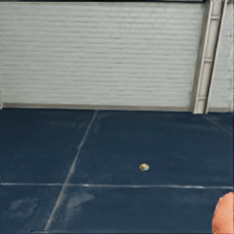
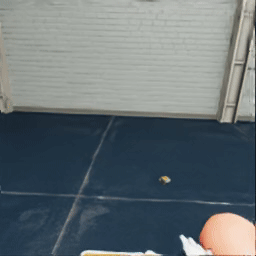

# VR Humanoid Behavior Lab

Control a **Unitree G1 with Inspire five-finger hands** in Isaac Sim 6.0 using Quest Pro
controllers or optical hand tracking. The project records hand input, robot joints,
gaze, object states, and images for later analysis and learning experiments.

[](https://github.com/isaac-sim/IsaacSim)
[](tools/run_humanoid_tests.py)
[](LICENSE)

[Setup and controls](HUMANOID_VR_CONTROL.md) ·
[Recorded demos](#recorded-g1-demos) ·
[Developer guide and validation](docs/humanoid-control.md) ·
[Performance](docs/humanoid-control.md#performance-and-cpu-physics) ·
[Learning pipeline](learning/README.md)

| G1 bottle lift | G1 package lift |
|:---:|:---:|
|  |  |

Robot-camera screenshots from the **7 September 2026** G1 recording, at their native
256×256 resolution. Colored targets and gaze highlights are part of the recorded scene.

## Current behavior

The default is **stationary manipulation**. A world constraint anchors the robot's
pelvis while its arms and fingers remain controllable. Walking, turning, keyboard
locomotion, and step-in-place inputs cannot move the base in this mode.

| Capability | Current implementation |
|---|---|
| Arm control | Controller grip clutches that arm; a valid optical wrist/palm pose activates hand tracking without a grip button or fist |
| Finger control | Five independent curl targets and separate thumb opposition from the optical skeleton; controller trigger closes the whole hand |
| Pickup | Nearby objects attach through distance-gated fixed-joint assistance; opening the hand, releasing trigger/grip, or pressing Y drops the object |
| Camera | Rigid mount on the robot's head/torso body; physical headset translation and rotation do not move the view, including during Pause |
| Gaze | Existing eye-tracking and highlighting behavior is retained; recordings label real eye input separately from HMD-forward fallback |
| Physics | CPU, with a configured 100 Hz physics timestep; rendering requests 90 Hz |
| Recording | Enabled by default: sensor CSVs, metadata, and a PNG image sequence |
| Walking and learned control | Optional walking modes and learning scaffolding remain available for experiments; they are outside the stationary-mode acceptance results |

Inspire has six independent hand actuators. Distal knuckles are coupled, so it cannot
reproduce every human knuckle angle or finger-splay movement separately.

## Recorded G1 demos

These excerpts show **assisted pickup, lifting, and release** in a recorded stationary
G1 session. Click a preview to open its video file, or use the MP4 links below.

| Bottle pickup and transfer | Package pickup and release |
|:---:|:---:|
| [](docs/readme/g1-bottle-pickup.mp4) | [](docs/readme/g1-package-pickup.mp4) |
| [Open / download MP4 · 4.1 s](docs/readme/g1-bottle-pickup.mp4?raw=true) | [Open / download MP4 · 3.1 s](docs/readme/g1-package-pickup.mp4?raw=true) |

Videos are silent H.264 at 256×256 and 10 frames per simulated second. Playback follows
**simulation time**, not the slower wall-clock capture rate. These are visual examples;
they do not establish real Quest finger-tracking quality or camera-lock validation.
See [media provenance and export commands](HUMANOID_VR_CONTROL.md#screenshots-and-videos)
and the [validation results](#validation-and-known-limitations) for those distinctions.

## Quick start

The tested workflow uses a Windows Isaac Sim 6.0 standalone installation and the
complete modified `isaacsim.robot.policy.examples` extension. A full Isaac Sim source
build is optional. For Quest Pro, keep the working OpenXR runtime and gaze setup;
the documented working connection uses SteamVR with Steam Link.

1. Clone this fork's teleoperation branch and fetch its Git LFS assets:

   ```powershell
   git clone --branch TeleopG1Sim https://github.com/soheilAppear/IsaacSim-HumanoidBehavior.git
   cd IsaacSim-HumanoidBehavior
   git lfs install
   git lfs pull
   ```

2. Follow [Installation](HUMANOID_VR_CONTROL.md#installation) to copy or link the
   **complete extension** into the standalone installation. It includes the robot
   wrapper, helper modules, registration, and bundled assets.
3. Check `ISAAC_DIR` inside [tools/launch_isaac_vr.bat](tools/launch_isaac_vr.bat).
   Its current value points to the maintainer's Windows installation; edit it if your
   installation is elsewhere. Save any stage changes and close the previous Isaac
   session before launching:

   ```powershell
   .\tools\launch_isaac_vr.bat
   ```

   The launcher enables the Python server and requests OpenXR skeletal hand tracking
   before the XR session starts.
4. Open **Window → Examples → Robotics Examples → Policy → Humanoid**
   (panel title **Humanoid: Unitree G1**), click **LOAD**, then **Play**.
5. Begin with the reachable packages on the near edge of the small front-right table.

See [Running](HUMANOID_VR_CONTROL.md#running) for the detailed startup procedure.
After changing Python source, restart Isaac Sim and reload the example so it uses
the updated classes.

## Controls

| Input | Action |
|---|---|
| Hold left/right **grip** | Move and rotate that arm; grip alone leaves the fingers open |
| **Trigger** | Close that hand; request nearby pickup at 60% travel and release below 35% |
| Release **grip** | End that arm's tracking and release its held object |
| **Y** | Drop both objects; release/open before the next grab |
| **B** | Restore the fixed robot-head view |
| Left stick click | Keep the camera locked in stationary mode |
| Sticks, X/A, locomotion keys, head movement | No base movement in stationary mode |
| Open optical hand | A valid wrist/palm pose activates the arm without a fist; fingers update independently from valid digit landmarks |
| Bend an optical finger | Move the corresponding robot finger |
| Close/open optical hand | Request nearby pickup/release using average finger curl |

For controller pickup, **hold grip**, reach with the trigger released, then pull the
trigger when the actual robot fingers are close to the object. Keep grip and trigger
held to carry; release the trigger to drop. A target marker or highlight alone does
not establish pickup range. See the [full control guide](HUMANOID_VR_CONTROL.md#controls)
for optical thresholds, tracking loss, and release behavior.

## Validation and known limitations

Recorded checks on **7 September 2026**:

| Check | Result and scope |
|---|---|
| Offline regressions | **82 passed**, including open-hand acquisition without buttons, independent fingers, grip/pickup, camera, lifecycle, and gaze regressions |
| Live grip and pickup replay | Passed with real PhysX: attached, lifted, and released a package; stationary base unchanged |
| Live finger replay | All ten fingers and both thumb-opposition joints moved independently; controller fallback and tracking-loss checks passed |
| Live camera replay | Fixed camera-to-body mount held during Play and Pause; tested with the Quest session connected |
| Real eye input | `eye_tracker` was observed with zero failed updates during the connected checks; gaze implementation/settings were preserved |
| Real Quest finger input | Skeletons arrived intermittently. The reported fist-only detection symptom remains unresolved; full open-hand/finger hardware acceptance is pending |

The live replays inject input at the XR boundary and measure real simulation behavior.
They establish control and physics behavior; they do not establish headset tracking
quality. Generic grip/aim/pinch/poke interaction poses are insufficient for
individual fingers. A detected controller model also does not establish that a real
hand skeleton is reaching Isaac. See [Troubleshooting](HUMANOID_VR_CONTROL.md#troubleshooting).

Run offline tests with Isaac Sim's Python wrapper:

```powershell
& "C:/path/to/isaac-sim-standalone-6.0.0-windows-x86_64/python.bat" tools/run_humanoid_tests.py
```

With the updated example loaded and the Python server enabled, run live checks
**one at a time** using ordinary host Python:

```powershell
python tools/validate_camera_live.py
python tools/validate_fingers_live.py --timeout 300
```

These replays restore live input and leave the timeline paused. To observe real
hands, press Play, switch the headset to bare hands, and bend individual fingers:

```powershell
python tools/observe_hand_tracking_live.py --seconds 20
```

The observer changes no input, timeline, or gaze settings. Commands for the separate
pickup/highlight replay, which temporarily substitutes gaze input, and detailed
results are in [Automated validation](docs/humanoid-control.md#automated-validation).

## Performance

**100 Hz physics and 90 Hz rendering are configured rates, not measured performance
guarantees.** A recent loaded session advanced roughly 0.3 simulated seconds per wall
second, which stretches control response to about three times normal duration.

The code performs synchronous PNG encoding and CSV writes inside physics callbacks,
creates an additional recording-camera render product, and repeats some robot-pose
and IK reads. These are candidates for measurement; their individual contribution
has not yet been isolated. CPU physics was chosen using older scene measurements,
which do not establish current performance.

The next useful comparison is the same scene with recording enabled and disabled
**before loading**, with only one Isaac session open. The
[performance guide](docs/humanoid-control.md#performance-and-cpu-physics) explains the
settings, measurement procedure, and limitations. Gaze and camera behavior should be
held constant during that comparison.

## Data and learning

Sessions are written under `~/BehavioralCollection/raw_sessions/` with sensor CSVs,
`metadata.json`, frame timestamps, and eye-camera PNGs. Rates are defined in simulation
time; gaze queries run at 50 Hz and their latest result is reused by 100 Hz log rows.
Periodic flushing limits buffered data, but an interrupted process can still lose
unflushed rows.

Gaze hits record the collider intersected by the supplied ray; they are observations
of the gaze signal, not a guarantee of human intent. Fixed-joint pickup is identified
as assisted grasping. See [Behavioral data collection](HUMANOID_VR_CONTROL.md#behavioral-data-collection)
for files and columns.

The [learning directory](learning/README.md) contains the planned dataset and
world-model workflow. A trained planner is not integrated into the current robot
controller.

## Project layout

| Path | Purpose |
|---|---|
| [interactive/humanoid/](source/extensions/isaacsim.robot.policy.examples/isaacsim/robot/policy/examples/interactive/humanoid/) | Scene, input, IK, pickup, camera, gaze, and recording |
| [robots/g1.py](source/extensions/isaacsim.robot.policy.examples/isaacsim/robot/policy/examples/robots/g1.py) | Stationary anchor, joint control, optional locomotion, and reset |
| [tools/](tools/) | VR launcher, live Python helper, observers, and validation replays |
| [tools/tests/](tools/tests/) | Offline control regression suite |
| [HUMANOID_VR_CONTROL.md](HUMANOID_VR_CONTROL.md) | Installation, operation, recording, and troubleshooting |
| [docs/humanoid-control.md](docs/humanoid-control.md) | Implementation details, performance, and validation evidence |
| [learning/](learning/) | Learning workflow plan and directory scaffolding |

## Earlier captures


This clip was recorded with the earlier H1 robot. It illustrates gaze highlighting
and recording; the current G1's stationary behavior and finger validation are
described above.

## Isaac Sim source and licensing

This fork includes the Isaac Sim source tree. For full simulator development, see
the [upstream Isaac Sim repository](https://github.com/isaac-sim/IsaacSim),
[Windows developer setup](docs/readme/windows_developer_configuration.md), and
[container build guide](tools/docker/README.md). `build.bat --help` or
`./build.sh --help` lists this checkout's source-build options.

Repository licensing is described in [LICENSE](LICENSE). Bundled policies and assets
retain their own notices; see the [setup guide's license references](HUMANOID_VR_CONTROL.md#license).
Fork-specific issues belong in [this repository's issue tracker](https://github.com/soheilAppear/IsaacSim-HumanoidBehavior/issues).
